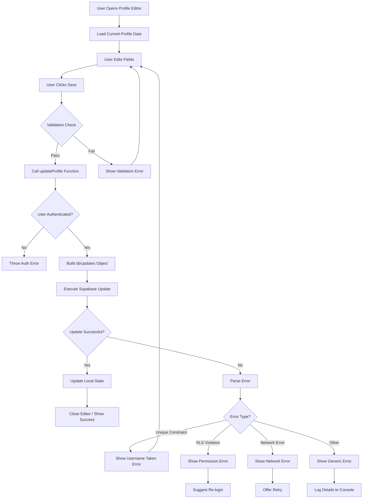

# Profile Update Flow Diagram

## Key Failure Points

### 1. Validation Stage

- Required fields empty
- Invalid phone format
- Username format violations

### 2. Authentication Stage

- Session expired
- User object null
- Supabase client not initialized

### 3. Database Operation Stage

- **Unique constraint violation** (username already exists)
- **RLS policy rejection** (auth.uid() doesn't match)
- **Network/timeout issues**
- **Database schema mismatch** (missing columns)

### 4. State Update Stage

- React state update fails
- Context not properly updated
- UI doesn't reflect changes

## Current Error Handling Gaps

1. **Error Message Specificity**
   - Current: "Failed to update profile. Username might be taken."
   - Problem: Assumes username issue, hides actual error

2. **Error Recovery Options**
   - No retry mechanism
   - No partial save option
   - No offline capability

3. **User Feedback**
   - No loading states for async operations
   - No success confirmation
   - No field-specific validation errors

## Recommended Improvements

### Immediate Fixes (Phase 1)

1. Enhanced error logging in `updateProfile`
2. Specific error messages in `ProfileEditor`
3. Username availability check before submit

### Medium-term Improvements (Phase 2)

1. Real-time username availability indicator
2. Session validity check before update
3. Retry mechanism for network errors

### Long-term Enhancements (Phase 3)

1. Offline profile editing with sync
2. Progressive enhancement (save partial changes)
3. Audit logging of profile changes
